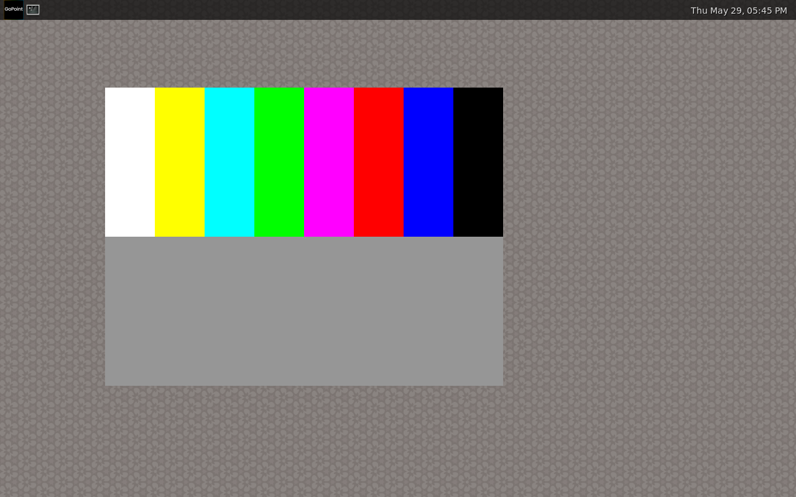
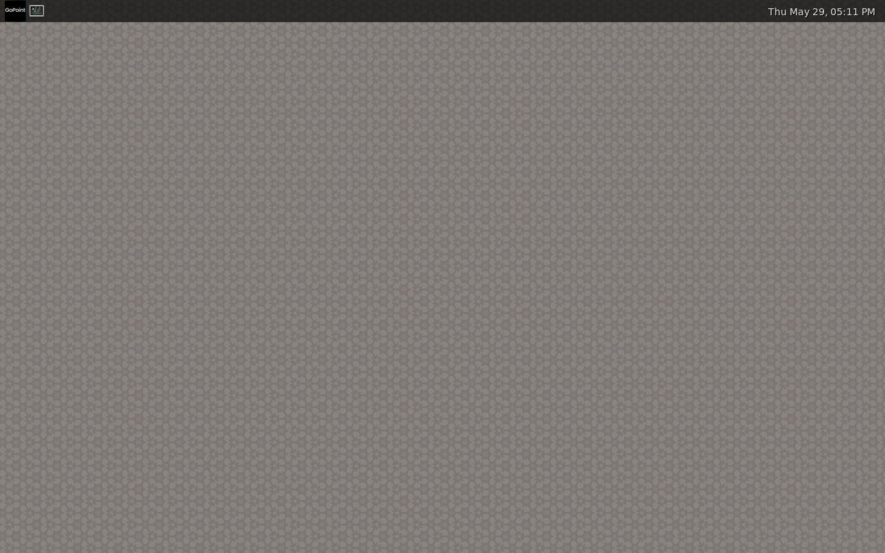
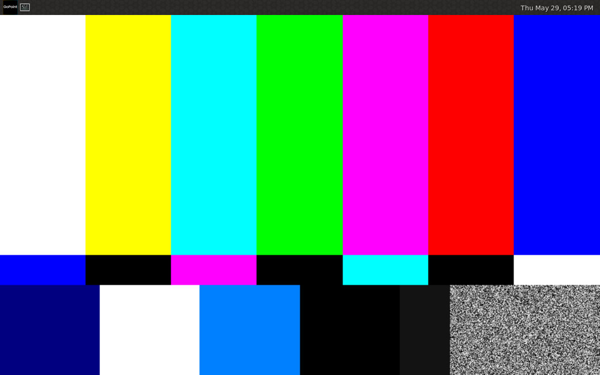

# qemu-imx95

A QEMU machine type for the NXP **i.MX 95** SoC, targeting the **19x19 EVK**
(LPDDR5) variant.

> **This is a fork of QEMU mainline.** The i.MX 95 work lives on the
> `imx95-netc` branch (the repository default and the upstream candidate),
> from its tip back to the upstream branch point `edcc429e9e`; the vast
> majority of the ~129k-commit history is inherited from upstream QEMU.
> `imx95-netc` is the full series — v1 (the A55/M33/M7 complement) plus the
> v2.0.0 NETC networking work — in one linear history. The older
> `imx95-scaffold` branch is the pure-v1 line, kept for reference and without
> NETC. The upstream QEMU README is preserved at [`README.rst`](README.rst) —
> this file describes the i.MX 95-specific work.

qemu-imx95 boots stock NXP BSP Linux to userspace with the **real NXP System
Manager firmware** running on the emulated Cortex-M33 serving the Cortex-A55
cluster's SCMI traffic. It brings up much of the EVK: **NETC networking**
(ENETC, `eth0` up with working ping), **read/write SD/eMMC storage** (a real
ext4 rootfs over uSDHC/ADMA), the **DPU display** with multi-plane compositing,
both pixel pipelines and a **Weston/Wayland desktop**, the **2D blit engine**
(real NXP G2D), **HW JPEG** encode/decode, **FlexCAN**, **USB** (HID keyboard),
three **ASoC audio cards**, the **Neutron NPU** stack, **expandable I²C** (all
eight LPI2C, `-device`-attachable), and the **Cortex-M33** real-time core
running real NXP firmware plus a **Cortex-M7** with A55↔M7 RPMsg. Intended use
cases are BSP development, System Manager firmware development, peripheral-driver
development, and CI for the above. It is not cycle-accurate. The GPU and the VPU (Wave6) video codec are stubbed at probe
time only — no GPU rendering, no VPU video codec — while the HW JPEG codecs are
functional; and the Neutron NPU brings up end to end but its proprietary compute
is out of scope (see [Known limitations](#known-limitations)).

Structural and stylistic conventions follow the upstream i.MX 8MP code
(`hw/arm/fsl-imx8mp.{c,h}`, `hw/arm/imx8mp-evk.c`); the long-term aim is to be
upstream-mergeable into QEMU mainline.

**Maintainer:** Kyle Fox ([@kylefoxaustin](https://github.com/kylefoxaustin))
(see [`MAINTAINERS`](MAINTAINERS) for the canonical entry).


*Real NXP BSP Linux scanned out at 1920×1200 by the emulated DPU (FetchLayer →
FrameGen), on the stock `imx95-19x19-evk` device tree. Six Tux logos = six
Cortex-A55 cores.*

## Quickstart

This fork **builds and runs as-is** — everything needed to *use* the i.MX 95
machine is on the default `imx95-netc` branch (a plain clone lands there).
Nothing needs patching. (The `docs/reviews/` patch artifacts are for
*contributing back* to upstream QEMU; you never apply them to use this fork.)

**1. Clone and build** — a standard QEMU build (verified on Ubuntu 22.04+; see
[Building](#building) for host packages):

    git clone https://github.com/kylefoxaustin/qemu-imx95.git
    cd qemu-imx95
    mkdir build && cd build
    ../configure --target-list=aarch64-softmmu
    ninja qemu-system-aarch64
    ./qemu-system-aarch64 -M help | grep imx95     # -> imx95-19x19-evk

**2. First boot in seconds — no external artifacts.** The in-tree Cortex-M7
firmware boots the M7 standalone and writes a fingerprint the test checks.
(No SM firmware needed: the machine force-starts the M7 directly when no SM is
present. When the SM is loaded, it owns the M7 lifecycle instead.)
You need a bare-metal `arm-none-eabi` toolchain (Ubuntu: `gcc-arm-none-eabi`).
Run from the repo root (`cd ..` if you're still in `build/`):

    make -C tests/cm7-hello TOOLCHAIN=arm-none-eabi-
    tests/m7-boot/run.sh        # -> "M7 fingerprint 0xC0FFEE07 detected"

That proves the emulator end-to-end without downloading anything from NXP.

**3. The full stack — Linux + System Manager + M7.** Booting Linux to userspace
needs four artifacts built from NXP sources (the SM firmware, a kernel `Image`,
a DTB, an initramfs). They are not redistributable, so they aren't in the repo —
see [Required artifacts](#required-artifacts) for the build recipes. The repo
ships the initramfs builder (`tests/busybox-initramfs/build.sh`), so the real
work is just building the NXP SM firmware + a kernel.

**Easiest path:** `tests/swap-boot/run.sh`, with the artifact paths set via the
`QEMU`/`SM_ELF`/`KERNEL`/`DTB`/`INITRD` env vars. The script encapsulates the
canonical invocation.

**Equivalent explicit command** (for adapting to other harnesses):

```
./build/qemu-system-aarch64 -M imx95-19x19-evk -m 2G -display none \
    -kernel <Image> -dtb <imx95-19x19-evk.dtb> -initrd <initramfs.cpio.gz> \
    -append "earlycon=lpuart32,mmio32,0x44380010 console=ttyLP0,115200 cpuidle.off=1 rdinit=/init" \
    -device loader,file=<m33_image.elf>,cpu-num=6 \
    -serial mon:stdio -serial null
```

Two cmdline details are load-bearing:

- **earlycon address `0x44380010`, not `0x44380000`.** The i.MX 95 LPUART has
  VERID/PARAM/GLOBAL/PINCFG at 0x00–0x0C and BAUD at 0x10. Linux's regular
  driver applies the `reg_off = 0x10` offset to the DT base automatically;
  earlycon does not, so the cmdline address must be pre-offset.
- **`cpuidle.off=1` is required** — see [Known limitations](#known-limitations).

For the M7's SM-managed lifecycle (boot, rpmsg, fault recovery), see
[`docs/system/arm/imx95-evk.rst`](docs/system/arm/imx95-evk.rst).

## Scope: what's modelled, what's deferred

This machine models the **full i.MX 95 CPU complement** — all three CPU types,
not a partial SoC. The headline: it boots **real Linux on the A55 cluster, with
SCMI served by the real NXP System Manager firmware** — not a software stub.

- **6× Cortex-A55 — application cluster (the headline).** Boots stock NXP BSP
  Linux 6.12.49 — and mainline aarch64 — all the way to userspace on all six
  cores.
- **1× Cortex-M33 — System Manager.** Runs the **real NXP SM firmware**, which
  is Linux's *sole* SCMI provider: clocks, power, perf/DVFS, reset and sensors
  are all served by the SM running on the emulated M33 over the MU mailbox
  cross-connect — there is no software SCMI server inside the machine.
- **1× Cortex-M7 — real-time domain.** The SM **boots, manages, and
  fault-recovers** it alongside the A-cluster (the `imx95-v1.x` milestone,
  below).

That M7 work was the `imx95-v1.x` milestone, now **complete**: the M7 runs as a
TCG core with its own TCMs, released by the SM through the silicon-faithful
SRC / AONMIX `M7_CFG.WAIT` path; under SM orchestration it boots, Linux's
`imx_rproc` attaches, and the stock `imx_rpmsg_pingpong` module runs a
100-message round-trip over the MU7 cross-connect; and the SM cold-resets the
M7 on a fault (`SYSRESETREQ` → `lm_reset`) while the A-cluster keeps running.

See [`docs/imx95/known-limitations.md`](docs/imx95/known-limitations.md) §5 for
the per-step (Steps 2–6) detail, and
[`docs/system/arm/imx95-evk.rst`](docs/system/arm/imx95-evk.rst) for the
machine documentation.

**FlexCAN, networking, the DPU display and its 2D blit engine are functional;
USB and audio come up at the registration bar** — the five FlexCAN controllers
(real Linux driver), all three ENETC Ethernet ports (incl. the 10G), the DPU
display path (boot logo on screen) and the 2D blit engine (proven through the
real NXP G2D stack) run end to end, while the usb2 ChipIdea host (`usb-kbd`
input) and all three EVK ASoC sound cards bind and enumerate against stock Linux (see
"What runs today" for the per-device **functional** / **brings up** split).
Functional A/V datapaths (audio playback/capture, VPU decode) and other
customer-specific real-time peripherals (TSN, DSP) remain further out. See
[`docs/imx95/known-limitations.md`](docs/imx95/known-limitations.md) §5 for
the full statement.

## What runs today

Stock **NXP Linux 6.12.49** boots to userspace (PID 1) on the 6-core A55
cluster, on top of the real NXP **System Manager** firmware running on the
emulated Cortex-M33. The SM boots through its full init, runs its
logical-machine bring-up, and answers Linux's SCMI over a cross-connected MU2:

```
arm-scmi: SCMI Protocol v2.1 'NXP:IMX' Firmware version 0x333
scmi-perf-domain: Initialized 13 performance domains
arm-scmi: NXP SM BBM / CPU (9 cpus) / MISC / LMM (3 logical machines)
...
Run /init as init process
```

**On the A55 / Linux side** (full evidence in
[`docs/imx95/validation-report.md`](docs/imx95/validation-report.md)):

- Boots **three distinct kernels** — NXP 6.12.49 vendor, mainline 6.12.0,
  NXP 6.18.2 vendor — all reaching `/init`, all binding SCMI to the real SM.
- Boots **two distinct userspaces** — static BusyBox and a glibc-dynamic
  Yocto trim (real `bash` 5.2.37, dynamic coreutils, file-I/O integrity
  verified under sustained load).
- **Interactive Linux serial console** over ttyLP0 (BusyBox initramfs): typed
  commands reach the shell and output reaches the host terminal.
- **Full U-Boot boot chain** — SPL banner, SPL → U-Boot proper handoff over an
  emulated SD boot chain, and the U-Boot interactive prompt; the SM also boots
  standalone to its debug-monitor prompt (`tests/sm-banner/`).
- **Reproducible from a clean clone** — including a clean `ubuntu:24.04`
  container as a different user with only the README-documented dependencies.
- **24 h+ stability soak** (A55 + M33 path) — ran past its 24 h target to
  ~36 h: stable memory, data-integrity md5 unchanged across 4274 heartbeats,
  no panics or SCMI timeouts.
- **24 h "everything-soak"** (`tests/soak-everything/`) — every modelled
  datapath exercised concurrently (NETC ×3, audio, JPEG, USB-HID, DPU, FlexCAN,
  virtio-9p, camera, both PCIe RCs, M33 SM + M7) for a full day: 0 anomalies,
  flat RSS, 1368 in-guest roll-call heartbeats clean.
- **Two independent third-party robotics stacks ran to convergence** in the
  Linux userspace — cross-built and run by external adopters, not the author:
  **ORB-SLAM3**
  ([`orbslam3-imx95`](https://github.com/kylefoxaustin/orbslam3-imx95) —
  OpenCV + g2o + DBoW2, 139 MB vocabulary) and **VINS-Fusion**
  ([`vins-fusion-imx95`](https://github.com/kylefoxaustin/vins-fusion-imx95) —
  stereo-inertial VIO + Ceres). Real SLAM/VIO applications on a full
  glibc-dynamic userspace, ~21× TCG slowdown (functional portability, not a
  silicon timing estimate). The ORB-SLAM3 run surfaced the SDHCI shutdown bug;
  the VINS-Fusion run, on the fixed build, confirmed a clean guest poweroff.

**On the real-time (Cortex-M7) side** — the SM-managed M7 (the `imx95-v1.x`
milestone in Scope, above), validated end to end:

- **SM-orchestrated boot + `imx_rproc` attach** — the SM boots the M7 alongside
  the A-cluster; Linux attaches to the SM-managed core over MU7.
- **100-message `imx_rpmsg_pingpong`** round-trip over MU7 — env-gated
  `m7_rpmsg_pingpong` functional test (harness + recipe in `tests/m7-rpmsg/`).
- **SM cold-reset fault recovery** (`SYSRESETREQ` → `lm_reset`), exactly as on
  silicon — `tests/m7-fault-recovery/`.
- **Four soaks on the M7 path** — 36 h parallel-boot (Step 2), 36 h SM-driven
  release (Step 3), 21 h SM-managed (Step 5), and a full **24 h** clean run on
  the SDHCI-shutdown-fix build (2769 heartbeats, +1.3 % RSS, `SRC.SCR` bit 12
  held, 0 MMC command spew) — **0 anomalies across all four**; the full-24 h
  gate is now met. Full numbers in the validation report.
- Surfaced the generic `target/arm/ptw.c` PMSAv7 MPU fix — one of three
  generic-QEMU prereqs split out for upstream.

**Display, input, audio & media.** The EVK's output and HMI peripherals run
against stock Linux. Each device below is tagged **functional** (the host
driver's data path runs end to end — data actually moves) or **brings up** (the
driver binds and the device registers / enumerates — the registration bar, no
working host data path yet):

- **DPU display + compositing — functional.** The i.MX 95 DPU
  (`hw/misc/imx95_dpu.c`) reads plane framebuffers out of guest DRAM and
  composites them through the **LayerBlend** chain to a QEMU console. stock
  `dpu95` binds, fbcon comes up, and the **kernel boot logo renders** — six Tux
  penguins, one per A55. **Multi-plane compositing** works: a primary plus
  overlay planes blend in the modelled chain — each plane fed by a FetchLayer
  (RGB) or **FetchYUV + FetchEco (NV12, converted BT.601 → RGB)**, positioned by
  POSITION, **per-pixel/const alpha-blended** by BLENDCONTROL, and
  **nearest-neighbour scaled** when its on-screen rect differs from the source
  (resolving the FetchUnit → VScaler4 → HScaler4 → LayerBlend chain). Validated
  by booting libdrm `modetest`, atomically committing a primary + a 320×240
  overlay (RGB or NV12, native or 2× scaled) and confirming it composited over
  the primary via QMP screendump (`tests/compositing/`). The FrameGen vblank +
  shadow-load interrupts ride a from-scratch `fsl,imx-irqsteer`
  (`hw/intc/imx_irqsteer.c`), so atomic commits **complete on interrupt** (no
  `flip_done` timeouts). The display-output connector chain (pixel-interleaver →
  pixel-link → LDB → LVDS-PHY → panel) registers a DRM connector once enabled in
  the dtb. **Both pixel pipelines** are modelled — a second stream (FrameGen1 /
  CRTC 1) with its own console, LayerBlend chain and display-interrupt block
  (disp_irq2): with both LVDS channels + panels enabled, dpu95 brings up LVDS-1
  (CRTC 0) and LVDS-2 (CRTC 1) and a `modetest` atomic commit completes on CRTC 1
  (`tests/dual-pipe/`).

  

  *Multi-plane compositing: a primary plane (SMPTE bars) with an overlay window
  blended on top by the DPU LayerBlend chain, scanned out at 1280×800.*

   

  *Both pixel pipelines driven at once — CRTC 0 / LVDS-1 (left) and CRTC 1 /
  LVDS-2 (right), each with its own FrameGen, LayerBlend chain and
  display-interrupt block.*
- **2D blit engine — functional.** The DPU's 2D blit block (the Socionext
  display controller's blit engine, a DRM render node `dpu95-blit`) is modelled
  in `hw/misc/imx95_dpu.c`: the Command Sequencer's HIF command stream is
  decoded and the configured operation run — same-format **copy**,
  constant-colour **fill**, Porter-Duff **alpha-blend** (BlitBlend9), **scaling**
  (HScaler9/VScaler9), **rotation** (FetchRot9), and **RGBA↔YUYV / RGBA↔NV12
  colour conversion** (BT.601) — with the completion fence signalled through a
  ComCtrl SW interrupt. Proven through the real NXP **G2D** stack: stock
  `g2d_basic_test` drives `libg2d-dpu` over `/dev/dri/renderD128` and its
  `g2d_copy`, `g2d_cache_op` and Porter-Duff clear-mode self-checks all pass
  (`tests/blit/run.sh`); small g2d exercisers validate a 2× upscale + 90° rotate
  (`run-xform.sh`), an RGBA↔YUYV round trip (`run-convert.sh`) and an RGBA↔NV12
  round trip (`run-nv12.sh`); and a kernel-free `tests/qtest/imx95-blit-test.c`
  drives a synthetic cmdlist. The other YUV formats (I420/YV12/…) are not
  modelled yet.

  

  *The NXP `g2d_wayland_shm_test` running on the Weston desktop: `g2d_blitEx`
  renders the colour bars through the modelled DPU blit engine, and the result
  is presented to Weston via `wl_shm` and scanned out by the DPU. (The
  `g2d_wayland_dmabuf_test` variant needs the GL renderer's `linux-dmabuf`
  import, for which there is no GPU, so the shm path is used.)*
- **Wayland desktop — functional.** A stock NXP `imx-image-full` rootfs boots
  from a real read/write **eMMC** disk (over the uSDHC/ADMA datapath) and its
  systemd brings up **Weston** on the DPU/LVDS output — `/dev/dri/card0`, libseat
  (seatd builtin), the desktop shell, panel and clock all composite and scan out
  end to end. Like the i.MX 93 there is no 3D GPU (Mali is a probe-time stub), so
  Weston **software-renders** (`weston.ini` `use-g2d=false` / pixman); the default
  `use-g2d=true` wants the Mali GPU and exits with "No mali devices found". See
  `tests/weston/run.sh` (boots the `.wic`, switches the renderer to pixman
  in-guest, QMP-screendumps the desktop).

  

  *The NXP `imx-image-full` Weston desktop, scanned out at 1280×800 by the
  emulated DPU after booting an ext4 rootfs read-write from eMMC.*

  

  *A GStreamer `videotestsrc ! waylandsink` pipeline rendering a live SMPTE test
  pattern as a Wayland window on the running Weston desktop — produced by the
  GStreamer stack, composited and scanned out by the DPU.*
- **USB keyboard — brings up.** The usb2 **ChipIdea** host is modelled,
  so `-device usb-kbd` enumerates as a USB HID keyboard and drives the display
  window. Works on the **stock** EVK dtb: the host's VBUS regulator, gated by a
  PCAL6524 I²C expander on lpi2c7, is modelled so the host leaves deferred probe.
- **USB3 SuperSpeed (DWC3) — brings up.** The `snps,dwc3` core
  (`usb@4c100000`, `fsl,imx95-dwc3`) is modelled with QEMU's `usb_dwc3` (which
  wraps a sysbus xHCI), so `dwc3-core` binds and the xHCI registers as a USB 3.0
  **SuperSpeed host** (two root hubs), where the USB2 ChipIdea host above is
  EHCI. A low-priority reads-as-0 region under the 64 KiB DWC3 window keeps
  `dwc3_core_init`'s reads of the unmodelled glue registers from faulting
  (`tests/usb3/`). The `iommus=<&smmu>` phandle must be stripped (no SMMU model)
  for the core to probe, as with the Neutron NPU; device enumeration on the
  SuperSpeed host is a follow-on (USB device enumeration is via the ChipIdea
  host today).
- **PCIe Root Complex (pcie0 + pcie1) — functional.** A from-scratch DesignWare
  PCIe RC (`hw/pci-host/imx95_pcie.c`, `fsl,imx95-pcie`) — distinct from the NETC
  integrated-ECAM host. The imx95 dwc-core driver brings the link up through the
  "app" SERDES glue (PHY MPLL reported locked, `LTSSM_EN` gates the dbi link-up
  bit), programs the iATU, and a downstream **endpoint enumerates** with its BARs
  assigned in the controller's >4 GiB MEM window — e.g. an `-device
  e1000e,bus=imx95-pcie` shows up at `0000:01:00.0` (`tests/pcie/`). INTx routes
  to GIC SPI 306–309 (pcie0) / 312–315 (pcie1); MSI rides the GICv3 ITS (like
  NETC). Beyond link-up + enumeration, an arbitrary endpoint binds end to end: a
  `virtio-9p-pci` device's driver binds, MSI-X is delivered through the GICv3
  ITS, the endpoint DMAs its virtqueue out of guest RAM, and a 9p mount over the
  PCIe device reads a host file in the guest (`tests/pcie-9p/`, with the dtb's
  SMMU `iommu-map` stripped and `msi-map` made identity, like the USB3 path).
  **Both** general-purpose controllers are modelled: pcie0 (@0x4c300000, PCI
  domain 0) and pcie1 (@0x4c380000, domain 1) are independent instances of the
  same host with distinct bus names (`imx95-pcie` / `imx95-pcie1`), and they
  coexist — `tests/pcie1/` binds a `virtio-9p-pci` endpoint on the second
  controller (domain `0001`) end to end.
- **Audio — WM8962 playback + MICFIL capture functional; BT-SCO brings up.**
  `/proc/asound/cards` lists all three ASoC cards: `wm8962-audio` (SAI3 ↔ a real
  **WM8962** codec on lpi2c4, reading device-id 0x6243), `micfil-audio` (PDM
  mic), and `bt-sco-audio`. Both audio datapaths run end to end through the eDMA:
  - **Playback** — the SAI model (`hw/audio/imx95_sai.c`) clocks its TX FIFO out
    at the audio word rate and pulses a DMA request as it drains; a cyclic
    **eDMA** channel refills it from the ALSA ring (ring → SAI3 `TDR0`), and the
    clocked-out samples are handed to the QEMU audio backend. A real
    `snd_pcm_writei()` of a square wave plays the whole stream paced at the
    audio rate (`tests/audio/run-playback.sh`).
  - **MICFIL capture** — the MICFIL model synthesises a PDM sample stream into
    its FIFO and a cyclic eDMA channel reads `DATACH0` into the ALSA ring, so
    `snd_pcm_readi()` returns non-silent **S32_LE** samples
    (`tests/audio/run-capture.sh`).

  Both directions ride the eDMA cyclic (scatter/gather) path in
  `hw/dma/imx95_edma.c`, which models **both** the 32-bit TCD (edma1,
  `fsl,imx93-edma3`) and the **64-bit TCD** (edma2/3, `fsl,imx95-edma5`)
  layouts; a kernel-free `tests/qtest/imx95-edma-test.c` drives the MICFIL→eDMA
  capture and the eDMA→SAI3 (64-bit-TCD) playback datapaths. BT-SCO uses a dummy
  codec and has no real sample path, so it stays at the registration bar.
- **HW JPEG codecs — functional.** Encode and decode. The two dedicated CAST
  `mxc-jpeg` blocks (separate from the Wave6 VPU) are modelled as real
  descriptor-chain engines (`hw/misc/imx95_jpeg.c`): `/dev/video2` decodes a
  JPEG to a raw frame and `/dev/video3` encodes a raw frame to JPEG, both via
  libjpeg (already a QEMU dependency through VNC). Beyond the model-level
  `tests/qtest/imx95-jpeg-test.c` encode→decode round-trip, decode is **proven
  through the real media stack** in `tests/gstreamer/`: a stock GStreamer
  `filesrc ! jpegparse ! v4l2jpegdec ! videoconvert ! filesink` pipeline runs
  end-to-end on the real `mxc-jpeg` V4L2 mem2mem driver and produces a correct
  NV12 frame.
- **Neutron NPU — brings up.** The NXP Neutron NPU comes up end to end:
  `remoteproc` loads `NeutronFirmware.elf` into the modelled DTCM/ITCM, the
  compute driver binds (`/dev/neutron0`), and the **LiteRT Neutron delegate runs
  `benchmark_model`** against it (`tests/neutron/`). The proprietary on-NPU
  compute is out of scope — the delegate offloads 0 nodes and inference falls
  back to the CPU — but the full firmware / remoteproc / driver / delegate stack
  is exercised, not a probe-time stub.
- **GPIO — functional.** The five SoC RGPIO controllers (`hw/gpio/imx95_gpio.c`,
  `fsl,imx95-gpio`) bind under `gpio-vf610`; output drives and input reads round
  trip (PDOR/PDDR ↔ PDIR), exercised by a devmem loopback in `tests/gpio/`.
- **TPM PWM — functional.** Both `pwm@424e0000/42510000` TPM blocks
  (`hw/misc/imx_tpm_pwm.c`) register six channels each, and sysfs
  period / duty / enable round-trips (`tests/pwm/`).
- **ADC — functional.** The `nxp,imx93-adc` block (`hw/misc/imx93_adc.c`) powers
  up, calibrates, and converts: `iio:device0` exposes eight channels that read
  back synthetic samples on a real EOC interrupt (`tests/adc/`).
- **I²C buses + slaves — functional.** The LPI2C masters that carry a device are
  real interrupt-driven masters with their slaves modelled: PCAL6408A / PCA953x
  expanders, a PCA9632 LED controller (`/sys/class/leds/pca963x:backlight`), and
  an ADP5585 GPIO/PWM expander MFD all probe over real buses (`tests/i2c/`).
- **FlexSPI + serial NOR — functional.** The `nxp,imx8mm-fspi` controller
  (`hw/ssi/imx_fspi.c`) decodes the `spi-nxp-fspi` driver's LUT and replays it
  onto an SSI bus carrying a real `m25p80`, over both the IP-command FIFO path
  and the AHB memory-mapped read window. Stock Linux enumerates a 64 MiB `mtd0`;
  `tests/flexspi/` reads erased flash and round-trips a page-program
  write/read-back. (The chip is a fully-SDR Micron `mt25ql512ab` stand-in: the
  EVK's `mt35xu01gbba` mandates an octal-DTR mode QEMU's generic `m25p80` does
  not model.)
- **LPSPI — functional.** All eight LPSPI controllers (`hw/ssi/imx95_lpspi.c`,
  `fsl,imx95-spi`) are real SSI masters: a TDR write shifts onto the bus and the
  shifted-in data returns via RDR. Each gets a uniquely-named SSI bus
  (`lpspi1..8`) so a slave can be attached with `-device <dev>,bus=lpspiN`, like
  the LPI2C controllers. The 19x19 EVK enables lpspi7 (a `bk4` spidev → a
  `/dev/spidev` node); `tests/qtest/imx95-lpspi-test.c` reads an ISSI NOR's
  JEDEC ID through the controller.
- **Watchdog — functional.** WDOG3 (`hw/misc/imx95_wdog.c`, the i.MX7ULP-style
  `fsl,imx93-wdt` clocked by the 32 kHz oscillator) binds as `/dev/watchdog0`;
  when enabled and not refreshed within the timeout it fires the QEMU watchdog
  action (`tests/watchdog/` arms it, stops pinging, and the bite powers off the
  VM). The System Manager's own WDOG2 stays non-functional so the SM can
  configure and refresh it without the timer ever biting.
- **DDR PMU — brings up.** `ddr-pmu@4e090dc0` (`fsl,imx95-ddr-pmu`,
  `hw/misc/imx95_ddr_pmu.c`) is a perf-interface compatibility block so the
  `fsl_imx9_ddr_perf` driver registers its perf PMU
  (`/sys/bus/event_source/devices/imx9_ddr0`) and `perf stat` can open the
  events. It is not a measurement — QEMU cannot observe the CPU↔DRAM traffic a
  real PMU counts, so the counters honestly read 0.
- **virtio-mmio + 9p host share — functional.** The machine instantiates a few
  generic virtio-mmio transports (modern virtio 1.0) and the board injects
  matching `/virtio_mmio@` nodes into the supplied dtb (`arm_boot_info`
  `modify_dtb` hook), so the guest enumerates them on a normal boot — not just
  at the QEMU device level. That gives the guest a place to attach virtio
  devices; `tests/virtio-9p/` boots with `-device virtio-9p-device` backed by a
  host directory and confirms the full path: the guest sees `virtio0`, 9p mounts
  over `trans=virtio`, and a host file is visible + readable in the guest `/mnt`.
- **MIPI-DSI display output — brings up.** The DSI display path comes up end to
  end: DPU CRTC → pixel link → MIPI-DSI host (`dsi@4acf0000`,
  `nxp,imx95-mipi-dsi`, `hw/display/imx95_dsi.c`) → DSI panel. The host model
  wraps the Synopsys dw-mipi-dsi core: it answers the three status polls
  (`DSI_VERSION`, `DSI_CMD_PKT_STATUS` reporting the FIFO idle so the panel's
  DCS init stream drains, `DSI_PHY_STATUS` lock) so the bridge enables and the
  panel comes up; the DPU model does the scanout. `tests/dsi/` applies a Raydium
  RM67191 DSI panel overlay (`fdtoverlay`) and confirms the bridge binds to the
  DPU pixel link, the panel init completes (no MCS failure), and `card0-DSI-1`
  reports **connected** with a 1080×1920 mode — the same DRM scanout the LVDS
  boot-logo path uses, here over DSI.
- **Camera (MIPI CSI-2 → ISI) — functional (capture).** A V4L2 client captures
  frames end to end through the media graph. The ISI capture engine
  (`isi@4ad50000`, `fsl,imx95-isi`, `hw/display/imx95_isi.c`) registers all
  eight `mxc_isi.N.capture` `/dev/video` nodes and, on a channel's `CHNL_EN`,
  DMAs a synthesised moving test pattern into the capture buffers (raising the
  per-channel frame-stored IRQ) — the same contract the `imx8-isi` driver
  drives. An OV5640 MIPI sensor model (`hw/i2c/ov5640.c`, answering the chip-ID
  read) lets the `ov5640` driver register its subdev. The MIPI CSI-2 receivers +
  combo D-PHY are readable stubs (the dwc-mipi-csi2 stop-state poll passes on a
  0 read). `tests/camera/` applies an ov5640 overlay (`fdtoverlay` onto the base
  dtb's symbols), then a cross-built V4L2 client (`v4l2_cap.c`) sets up the
  streams-API pipeline — `ov5640 → csi → formatter → crossbar → ISI` — and
  `REQBUFS`/`STREAMON`/`DQBUF`s five frames off `/dev/video0`, asserting the
  ISI's moving test pattern lands in the MMAP'd buffers. (Getting `STREAMON` to
  validate hinged on propagating the sensor's exact `UYVY8_1X16` MIPI code along
  the crossbar's connected sink; the client carries a userspace `link_validate`
  oracle that pins any per-link format mismatch, since the kernel logs it only
  at the invisible `dev_dbg` level.)
- **Virtual camera (host-frame source) — functional.** The ISI can scan **real
  host images** out of the capture pipeline in place of the synthetic test
  pattern, turning the model into a sensorless camera that feeds a fixed frame
  sequence to a vision pipeline. A `frames` string property on `imx95.isi`
  (`-global driver=imx95.isi,property=frames,value=<path>`) points at a
  directory of `*.raw` frames (lexically sorted) or a single file of
  back-to-back raw frames; each tick the active channel reads the next frame
  straight from the host (whole-frame reads) and DMAs it out at the channel's
  pitch, looping. An undersized frame falls back to the gradient, so the
  capture geometry must match. `tests/virtual-camera/` feeds a known host frame
  through the same `ov5640` + V4L2 `STREAMON`/`DQBUF` path and asserts the
  `DQBUF`'d bytes are the host image, not the gradient — byte-for-byte through
  the ISI DMA.
- **NeoISP (camera image signal processor) — brings up.** The i.MX95 ISP
  (`isp@4ae00000`, `nxp,imx95-b0-neoisp`) is a register-driven V4L2 mem2mem
  device — debayer / tone / colour pipeline — with two MMIO windows
  (`registers` @0x4ae00000, `stats` @0x4afe0000) the `neoisp` driver programs
  directly (no firmware/remoteproc; the separate `nxp,imx95-isp-rproc` accelerator
  is a different path). The EVK leaves it `status=disabled`; with it enabled the
  driver binds end to end — ioremaps both windows, builds its regmap, runs the
  soft-reset handshake, takes the camera power domain + cameramix clocks, requests
  IRQ 222, and registers its **eight node-groups** of V4L2 nodes
  (`neoisp-input0/input1/params/frame/ir/stats` each, 48 `/dev/video` nodes) plus
  the per-group media devices, no external abort (`tests/neoisp/`). The two MMIO
  windows are already backed by the machine, so this needs no model change. As
  with the JPEG/Neutron blocks, the proprietary per-pixel ISP compute is the
  fidelity ceiling; this is the registration bring-up.
- **OCOTP eFuse + EdgeLock secure-enclave — brings up.** The fuse driver
  (`fsl-ocotp-fsb-s400`, `efuse@47510000`) reads the SoC's one-time-programmable
  fuses — partly from the FSB shadow, partly through the **EdgeLock secure-enclave
  (ELE / "S400") firmware service** — so it only binds once the Linux `fsl-se`
  HSM interface (`secure-enclave-0`, on `elemu3`) has probed. Both are now up:
  the ELE message **responder** (`hw/misc/imx95_ele_server.c`) answers the
  driver's `GET_INFO` / `GET_STATE` / `READ_FUSE` commands, and `elemu3`'s RX
  interrupt (GIC SPI 24) is delivered so the IRQ-driven `fsl-se` driver wakes
  (unlike U-Boot, which polls). The HSM secure-enclave configures, the efuse
  nvmem device (`fsb_s400_fuse0`) registers, and the `eth_mac0/1/2` cells read
  back real NXP-OUI MAC addresses seeded into the FSB shadow (`tests/ocotp/`).
  The closed ELE firmware is **not executed** — the responder fakes the message
  protocol, which is fine because fuse reads are plain data (no keys); the
  enclave's crypto / secure-boot services stay out of scope.
- **Extra SAIs (sai2/4/5) — bring up.** The EVK wires only sai1 + sai3 (above);
  `sai2@4c880000`, `sai4@42660000` and `sai5@42670000` are EVK-disabled. The
  machine now instantiates all five (same `fsl,imx95-sai` IP), so a patched dtb
  enables the three extra nodes and the `fsl-sai` driver probes and binds each
  (`tests/sai-extra/` confirms all three bind). A full playback card would also
  need a codec + card node; this is controller registration bring-up.
- **SPDIF / XCVR — functional (playback).** The audio transceiver (`xcvr@42680000`,
  `fsl,imx95-xcvr`, `hw/audio/imx95_xcvr.c`) is modelled so the `fsl_xcvr`
  driver brings it up and registers its SPDIF card (`imx-audio-xcvr`). Ported
  from the i.MX93 XCVR (shared IP) — the SET/CLR/TOG register aliases, the
  indirect PHY/PLL "AI" interface, the firmware code RAM, and the cyclic-eDMA TX
  FIFO. The i.MX95 part (unlike the 93's firmware-free SPDIF-only block) loads
  `xcvr-imx95.bin` into the code RAM from runtime-resume and brings up the
  PHY/PLL; the model accepts the firmware writes (which arrive as 8-byte
  `memcpy_toio` stores) and acknowledges the AI accesses the driver polls. The
  node is EVK-disabled, so `tests/spdif/` boots a patched dtb that enables it +
  adds the card, stages the firmware + ASoC stack, and forces a runtime-PM
  resume to drive the firmware load and PHY bring-up, then plays a stream:
  the eDMA-paced TX FIFO drains over the 64-bit-TCD edma2 and the samples reach
  the audio backend (full writei + drain).
- **I3C — functional.** Both Silvaco I3C masters (`hw/i3c/svc_i3c.c`,
  `silvaco,i3c-master-v1`; `i3c1@44330000`, `i3c2@42520000`) are real
  controllers: the `svc-i3c-master` driver drives `MCTRL`/`MSTATUS`/`MWDATAB`/
  `MRDATAB`, runs Dynamic Address Assignment (no native I3C targets), and
  registers an I2C adapter for the bus's legacy-I2C devices. The 19x19 EVK
  leaves both nodes disabled, so `tests/i3c/` boots with a patched dtb that
  enables them and declares a `tmp105` legacy-I2C child on `i3c2`; a small
  i2c-dev helper then runs a SMBus config write/read round-trip to the sensor
  over the I3C master, confirming a real transfer traverses the bus end to end.

Audio playback (WM8962/SAI3) and MICFIL PDM capture are now functional (see the
Audio entry above); the remaining datapath gaps (BT-SCO, SAI RX capture) are
tracked in
[`docs/imx95/known-limitations.md`](docs/imx95/known-limitations.md).

**CAN — functional.** All five **FlexCAN** controllers are modelled
(`hw/net/can/flexcan.c`) on QEMU's CAN bus subsystem — real frame TX/RX, the
Linux-driver MCR handshake, individual RX mailboxes and CAN-FD geometry.
**Validated end-to-end with the real Linux `flexcan` driver:** the
`tests/flexcan/` harness boots two FlexCANs on one bus and the stock
`can-utils`-free self-test round-trips frames `can0` ⇄ `can1` at 500 kbps
(plus a kernel-free model check in `tests/qtest/flexcan-test.c`). Attach a host
SocketCAN backend (the stock EVK DT leaves the CAN nodes disabled, so enable
the node you want):

```
-object can-bus,id=canbus0 \
-object can-host-socketcan,id=canhost0,if=vcan0,canbus=canbus0 \
-machine imx95-19x19-evk,canbus0=canbus0
```

**Networking — functional (v2.0.0).** The i.MX 95 NETC block is modelled end to
end: a functional GICv3 ITS, an integrated-ECAM PCIe host, and a from-scratch
**ENETC v4 Ethernet PF** (`hw/net/fsl_enetc.c`, PCI `1131:e101`) with a BD-ring
DMA engine and MSI-X routed through the ITS. The stock Linux `nxp_enetc4`
driver binds it, brings up **`eth0` at 1Gbps**, and **ping works** over a slirp
backend (`3 packets transmitted, 3 received, 0% loss`). RX multi-buffer scatter
and ring wraparound have deterministic, kernel-free qtests
(`tests/qtest/fsl-enetc-test.c`). For sustained traffic, a reproducible iperf
load-soak (`tests/netc/load-soak.sh`) drives the datapath bidirectionally: a
**24-hour run moved 4.76 billion frames / 7.19 TB at ~661 Mbps average
(740 Mbps peak), with zero rx/tx errors or drops, zero kernel anomalies, and
flat guest memory**, ending in a clean self-poweroff (a functional datapath
rate under TCG, not a silicon estimate). **All three ENETC ports are wired** —
the two 1G ports (ENETC0 + ENETC1), validated **back-to-back** with a dual-board
EVK ⇄ FRDM traffic test (`eth0` ⇄ `eth1` in separate netns,
`tests/netc/run-2port.sh`), plus the **10G port** (ENETC2, `ethernet@10,0`):
the same ENETC v4 PF brought up via a fixed-link `10gbase-r` node, so
`enetc4_pf` reports `eth2: Link is Up - 10Gbps/Full` (`tests/netc/run-10g.sh`).
See [`tests/netc/`](tests/netc/) for the bring-up, two-port, 10G, and soak
recipes.

Other Tier-3 limitations (GPU/VPU stub-only, the Neutron
NPU brings up but does not compute) are
characterized with precise failure points — see
[`docs/imx95/known-limitations.md`](docs/imx95/known-limitations.md).

The campaign found and fixed two real bugs in the artifact before any
external user would have hit them: an LPUART FIFO read-only-bit storm
(commit `741af2f5e3`) and an undocumented `file` host-package dependency in a
test script (commit `7def38532a`).

## Roadmap

Near-term focus is **landing this machine upstream** — the series plus its
three generic-QEMU prereq patches (`target/arm/ptw.c`,
`target/arm/tcg/tlb_helper.c`, `hw/sd/sdhci.c`) to qemu-devel.

**NETC networking** (all three ENETC ports, incl. 10G), **FlexCAN** (all five
controllers), the **DPU display** (boot logo on screen), the **usb2 ChipIdea**
host (`usb-kbd` input), **audio** (all three ASoC cards), the **functional HW
JPEG** codecs (encode + decode via libjpeg, GStreamer-validated), and the
functional **GPIO / TPM PWM / ADC / I²C** peripherals are **done** and described
under "What runs today" above. **Linux block storage** is now functional too —
read/write **eMMC + SD** over the uSDHC/ADMA datapath, enough to mount an ext4
rootfs read-write and boot a **Weston desktop** off it. The **Neutron NPU** also
comes up end to end (`remoteproc` + driver + LiteRT delegate running
`benchmark_model`); only its proprietary on-NPU compute is deferred. What
remains is forward-looking:

| Feature | What | Target |
|---|---|---|
| **Functional display** | DSI/HDMI bridge timing and deeper KMS coverage — multi-plane compositing (RGB + NV12 planes, alpha-blend, scaling), the boot-logo scanout, a real vblank/irqsteer and **both pixel pipelines** (CRTC 0 + CRTC 1) already work today over the LayerBlend chain | next |
| **Camera ISP** | The ap1302 firmware-loading ISP front end (basic **MIPI CSI-2 → ISI V4L2 capture is now functional** via the ov5640 sensor — `STREAMON`/`DQBUF` real frames; the ISP's on-chip image processing is what remains) | after display |
| **Functional codec** | The VPU (Wave6) encode-decode datapath — the **JPEG codecs are now functional** (libjpeg-backed encode + decode, validated through the real GStreamer media stack); the firmware-driven Wave6 compute engine is not modelled | deferred |
| BT-SCO audio + SAI capture | A real sample path for the BT-SCO (dummy-codec) card and SAI RX capture (**WM8962 playback + MICFIL PDM capture are already functional**) | deferred |
| GPU / VPU / NPU compute | Functional Mali / Wave-VPU models, and actual NPU inference (the Neutron driver/firmware/delegate stack already brings up end to end; the proprietary NPU compute itself is out of scope) | deferred |
| Real-time peripherals | TSN, DSP for M7 / mixed-criticality workloads (FlexCAN + audio SAI already done) | deferred |

The deferred rows are characterized with precise failure points in
[`docs/imx95/known-limitations.md`](docs/imx95/known-limitations.md); none is a
fidelity compromise in the modelled hardware.

## Required artifacts

> **The System Manager firmware image is required.** The real SM on the M33 is
> the only SCMI provider — there is no built-in software SCMI server. Booting
> without `-device loader,file=<m33_image.elf>,cpu-num=6` leaves the M33 halted
> and **nothing answers SCMI**, so Linux hangs at `arm-scmi` probe. This is not
> a bug; it matches real silicon, where the SM is always present.

To boot Linux to userspace you need four artifacts, all built from the NXP BSP:

| Artifact | Where from |
| --- | --- |
| Kernel `Image`              | `references/linux-imx`, imx defconfig |
| `imx95-19x19-evk.dtb`       | same kernel build |
| initramfs (`*.cpio.gz`)     | any aarch64 rootfs with `/init` |
| SM firmware `m33_image.elf` | `references/imx-sm`, `make config=mx95evk` |

**Where the test scripts look for them.** Every artifact path is overridable by
an env var (`SM_ELF`, `KERNEL`, `DTB`, `INITRD`), so you can point the scripts
anywhere. If you don't set them, the scripts fall back to a convention
directory `$IMX95_ARTIFACTS` (default `~/imx95-artifacts`) laid out as:

```
$IMX95_ARTIFACTS/
├── m33_image.elf                          # SM firmware
└── linux-build/arch/arm64/boot/
    ├── Image                              # kernel
    └── dts/freescale/imx95-19x19-evk.dtb  # DTB
```

Either drop your artifacts there, set `IMX95_ARTIFACTS=/your/dir`, or set the
individual `SM_ELF`/`KERNEL`/`DTB` vars per run. The scripts print exactly which
var to set if an artifact is missing.

## Known limitations

**Deep cpuidle requires `cpuidle.off=1`.** Without it, Linux hangs shortly
after `SCMI Notifications - Core Enabled`. The mechanism is fully
characterized, and the gap is in QEMU core, **not** the i.MX 95 machine model:

1. Linux's `cpu-pd-wait` idle state has `local-timer-stop`, so an idling core
   shuts down its per-CPU arch timer and relies on a broadcast clockevent.
   **The machine model provides this** — `hw/timer/imx95_sysctr.c` is a real
   system-counter timer (live counter + compare-match IRQ on GIC SPI 72).
2. On entering that state, Linux's GIC `cpu_pm` notifier disables the per-CPU
   GIC interface (matching real silicon, where a deeper power state is entered).
3. **QEMU's GICv3 model does not implement the architectural WakeRequest** — it
   never wakes a halted CPU on a pending interrupt once the CPU interface is
   quiesced. So a cross-CPU wake (e.g. a `stop_machine` IPI) can't reach the
   idle core, and the boot hangs. This affects all GICv3 QEMU machines.
4. With `cpuidle.off=1`, Linux uses shallow WFI on the still-running per-CPU
   arch timer and boots cleanly. The proper fix is QEMU-core work, filed as a
   follow-up to qemu-devel.

**The GPU and the VPU (Wave6) are probe-time stubs** — their Linux drivers
register but no GPU rendering or VPU video codec occurs (the HW JPEG codecs, a
separate block, are functional). The **Neutron NPU brings up end to end**: the remoteproc
loads `NeutronFirmware.elf` into the modelled DTCM/ITCM, the compute driver binds
(`/dev/neutron0`), and the LiteRT Neutron delegate + `benchmark_model` run
(`tests/neutron/`) — but the NPU itself does not compute (the delegate offloads 0
nodes and inference falls back to CPU), since the proprietary firmware's inference
is out of scope.

Full diagnoses, including the icount × multi-CPU finding, are in
[`docs/imx95/known-limitations.md`](docs/imx95/known-limitations.md).

## Architecture overview

- **6× Cortex-A55** (GICv3 / GIC-600), the application cores running Linux.
- **1× Cortex-M33** running the real NXP System Manager firmware. Released from
  reset only when SM firmware is present in its ITCM.
- **MU2 cross-connect — the SCMI transport.** The A55-side mailbox
  (MUA @0x445b0000) and the M33-side mailbox (MUB @0x445c0000) are peer-linked
  over a shared SMT SRAM. Linux's SCMI doorbells on MUA reach the SM via MUB;
  the SM's responses on MUB raise the A55's MU IRQ via MUA.
- Real device models for the pieces the base boot exercises: LPUART, uSDHC, MU,
  GIC, the system-counter timer, ANATOP PLLs, SRC, GPC, ELE responder, LPI2C +
  PMICs, and the DPU display controller (FetchLayer scanout + a
  `fsl,imx-irqsteer` vblank). The networking, CAN, audio, JPEG and
  small-peripheral models listed under "What runs today" are likewise real;
  blocks no driver touches are logging stubs.

All memory-map addresses and IRQ numbers come from the NXP BSP, never guessed:
the Linux DTS
(`references/linux-imx/.../imx95.dtsi`) for peripherals the kernel sees, and
the U-Boot RM-derived header for the SCMI-routed peripherals SPL pokes before
SCMI is up. The RM is authoritative for register behaviour; the DTS for
addresses and IRQ numbers.

## Repository tour

| Path | Purpose |
| --- | --- |
| `hw/arm/fsl-imx95.c`, `include/hw/arm/fsl-imx95.h` | SoC realization: CPUs, GIC, M33, device wiring, memory map, logging stubs |
| `hw/arm/imx95-evk.c`        | 19x19 EVK board file |
| `hw/char/imx_lpuart.c`      | LPUART model (console) |
| `hw/misc/imx_mu.c`          | NXP MU (V2) model — doorbell + peer cross-connect |
| `hw/i2c/imx_lpi2c.c`        | LPI2C master (interrupt-driven) |
| `hw/net/can/flexcan.c`      | FlexCAN controller (all 5; QEMU CAN bus, CAN-FD) |
| `hw/net/fsl_enetc.c`        | NETC ENETC v4 Ethernet PF (PCIe endpoint; BD-ring DMA, MSI-X via ITS) |
| `hw/timer/imx95_sysctr.c`   | system-counter clockevent timer |
| `hw/misc/imx95_{src,anatop,gpc,pmic,dpu,ele_server,wdog}.c` | SM/Linux bring-up device models |
| `hw/misc/imx95_aonmix.c`    | AONMIX M7 CPU-WAIT gate (v1.x Step 5 — the SM's M7 run/hold control) |
| `tests/swap-boot/run.sh`    | full Linux-on-real-SM boot |
| `tests/sm-banner/run.sh`    | SM standalone to its debug monitor |
| `tests/cm7-hello/`, `tests/m7-boot/` | in-tree M7 firmware + standalone M7 boot test |
| `tests/m7-fault-recovery/`  | SM-driven M7 fault recovery test (v1.x Step 5) |
| `tests/flexcan/`, `tests/qtest/flexcan-test.c` | FlexCAN Linux end-to-end harness + model qtest |
| `tests/docker-repro/`       | clean-room reproducibility: build + boot in a pristine `ubuntu:22.04` container |
| `tests/netc/`, `tests/qtest/fsl-enetc-test.c` | NETC bring-up (DT patch + boot), iperf throughput load-soak, + RX-scatter/wraparound qtests |
| `tests/functional/aarch64/test_imx95_evk.py` | env-gated functional test (Linux boot + M7 fault recovery) |
| `scripts/probe_stall.py`    | A55-hang frame-pointer debugger ([scripts/README.md](scripts/README.md)) |
| `docs/system/arm/imx95-evk.rst`   | QEMU-conventions machine documentation (upstream prep) |
| `docs/imx95/methodology.md`       | debugging methodology + the project's working mode |
| `docs/imx95/known-limitations.md` | full limitation diagnoses |

## Building

    mkdir -p build && cd build
    ../configure --target-list=aarch64-softmmu
    ninja qemu-system-aarch64

**Host packages (Ubuntu 22.04, verified from a clean container).** This exact
set builds QEMU + runs every test from a pristine Ubuntu with nothing
pre-installed:

    sudo apt install -y \
        meson ninja-build python3 python3-venv python3-tomli \
        gcc libc6-dev pkg-config libglib2.0-dev libpixman-1-dev \
        binutils-aarch64-linux-gnu gcc-aarch64-linux-gnu \
        gcc-arm-none-eabi \
        netcat-openbsd \
        bison flex libssl-dev libgnutls28-dev efitools

What each group is for:

- `meson ninja-build python3 python3-venv python3-tomli gcc libc6-dev
  pkg-config libglib2.0-dev libpixman-1-dev` — the QEMU build itself.
  (`python3-venv` provides `ensurepip` and `python3-tomli` the TOML parser that
  QEMU's `configure`/meson need; both are stdlib on newer distros but separate
  packages on 22.04.)
- `binutils-aarch64-linux-gnu gcc-aarch64-linux-gnu` — the aarch64 bare-metal
  hello test + a static initramfs init.
- `gcc-arm-none-eabi` — the Cortex-M7 firmware tests (`tests/cm7-hello`,
  `tests/m7-boot`).
- `netcat-openbsd` — the M7 boot/fault tests drive QEMU's HMP monitor over a
  Unix socket with `nc -U`; the openbsd variant is the one with `-U`.
- `bison flex libssl-dev libgnutls28-dev efitools` — the U-Boot SPL test.

This list is exercised end-to-end by `tests/docker-repro/run.sh` (a clean
`ubuntu:22.04` container: build + smoke tests + a Linux boot to userspace).

## Smoke tests

    # machine registers
    ./build/qemu-system-aarch64 -M help | grep imx95

    # bare-metal hello (no SM firmware needed - useful to verify the build
    # itself before assembling the boot artifacts)
    cd tests/hello-imx95 && make && cd ../..
    ./build/qemu-system-aarch64 -M imx95-19x19-evk -nographic -m 2G \
        -kernel tests/hello-imx95/hello.bin      # -> "Hello from i.MX 95!"

    # M7 fingerprint (no SM firmware needed - verifies the M7 instance + TCMs)
    make -C tests/cm7-hello TOOLCHAIN=arm-none-eabi-
    tests/m7-boot/run.sh     # -> "M7 fingerprint 0xC0FFEE07 detected"

    # SM standalone to its monitor
    SM_ELF=<m33_image.elf> tests/sm-banner/run.sh

    # full Linux to userspace on the real SM
    tests/swap-boot/run.sh

    # audio: all three ASoC cards register (wm8962 / micfil / bt-sco)
    SND_MODDIR=<bsp>/lib/modules/<kver>/kernel/sound tests/audio/run.sh

    # HW JPEG codecs register as /dev/video2 (dec) + /dev/video3 (enc)
    JPEG_MODDIR=<bsp>/lib/modules/<kver>/kernel/drivers/media tests/jpeg/run.sh

    # HW JPEG functional decode through the real GStreamer media stack
    BSP_ROOTFS=<imx-image-full rootfs> tests/gstreamer/run.sh

    # functional small peripherals: RGPIO, TPM PWM, i.MX93 ADC, LPI2C buses
    tests/gpio/run.sh ; tests/pwm/run.sh ; tests/adc/run.sh ; tests/i2c/run.sh

    # FlexSPI + serial NOR: enumerate a 64 MiB mtd, read + write/read-back
    tests/flexspi/run.sh

    # code-sweep: real third-party source cross-built + run on the A55, checked
    # against each project's own oracle (36 CPU + 8 peripheral items)
    tests/code-sweep/run.sh ; tests/code-sweep/run-peripheral.sh

    # in-guest build tier: compile AND run on the A55 (self-hosting proof) -
    # tcc+musl, real gcc/g++ off eMMC, and real upstream projects (bzip2/zlib/lua)
    # built natively + their own `make test` passing
    tests/in-guest-build/run.sh ; tests/in-guest-build/run-gcc.sh
    tests/in-guest-build/run-gcc-build.sh

The per-block fidelity record (which blocks COMPUTE vs FAULT-honestly vs are
flagged) is [`docs/validation/fidelity-audit.md`](docs/validation/fidelity-audit.md);
machine-readable results of record are
[`docs/validation/code-sweep-matrix.yaml`](docs/validation/code-sweep-matrix.yaml).

## Methodology & contributing

The project is built measure-first: propose a hypothesis, verify it against
data, and re-plan when measurement disagrees. The debugging techniques that
recur (the "five pillars"), the register-class triage pattern, the v1.x
cross-layer patterns (multi-layer probe failures, generic bugs surfaced by
platform-specific symptoms, one device model serving multiple protocols, "a
wall is a hypothesis"), and the working mode itself are written up in
[`docs/imx95/methodology.md`](docs/imx95/methodology.md); a fresh-eyes review
discipline (the GitHub render-cache pitfall) is in
[`docs/imx95/reviewer-discipline.md`](docs/imx95/reviewer-discipline.md).
Per-milestone design and review notes are kept in `docs/reviews/` as local
working artifacts — they are not committed to the repo (the directory is
`.gitignore`d), so they won't appear in a clone.

## Milestone history

- **v0.0.1–v0.0.2** — scaffold; real memory map from the DTS; `imx.lpuart`
  model + LPUART1 console; bare-metal hello.
- **v0.1** — U-Boot SPL banner. NXP MU model, SCMI server stub, ELE responder,
  watchdog stub.
- **v0.2** — SPL → U-Boot proper over an emulated SD boot chain. `TYPE_IMX_USDHC`,
  the uSDHC SDMA-boundary fix, AHAB-container SD boot.
- **v0.3** — U-Boot interactive prompt. LPI2C, `psci-conduit=smc`, USB stubs,
  the LPUART WATER RX-count fix.
- **v0.4** — Linux 6.12.49 boots via `-kernel`: 6 A55s up via PSCI, GICv3, SCMI
  mailbox transport.
- **v0.5** — Linux to userspace (on the C-stub SCMI server); the cpuidle hang
  root-caused and worked around with `cpuidle.off=1`.
- **v0.6** — Cortex-M33 SM core; loads + executes the real NXP SM firmware.
- **v0.7** — SM through early init + PMIC/IO-expander (BBNSM, WDOG2, XCACHE,
  HSIOMIX, LPI2C + PF09/PCAL6408A).
- **v0.8** — SM to its debug monitor (GPC modelled).
- **v0.9** — the real SM serves Linux's SCMI: dual-aperture MU2 cross-connect +
  the SM driven through full init (PF53, FSB, SRC, eMcem, ELE, ANATOP/ARM-PLL,
  config-ops) so `LMM_Init` enables the AP mailbox.
- **v0.10** — Linux boots to userspace **on the real SM**: walked the
  deferred-probe cascade (eDMA, the DPU command-sequencer, clock-provider
  syscons, netc, usb3) to `/init`.
- **v1.0** — polish: boot time cut ~9× (icount off the default boot path), the
  system counter modelled as a real clockevent timer, the vestigial C-stub SCMI
  server removed (real SM is now the only provider), and documentation.
- **v1.0.1** — LPUART RX read-only-bit storm fix (commit `741af2f5e3`).
- **v1.x** — Cortex-M7 integration, completing the i.MX 95 CPU complement
  (6× A55 + M33 SM + M7). Six steps: M7 instance + parallel boot + 36 h soak
  (Step 2); silicon-faithful SM-driven release via `SRC_GEN.SCR.M7MIX_RELEASE`
  + 36 h soak (Step 3); SM-orchestrated boot + Linux `imx_rproc` attach + stock
  NXP `imx_rpmsg_pingpong` 100-message exchange + a generic ARMv7-M PMSAv7 fix
  in `target/arm/ptw.c` (Step 4); SM-driven M7 fault recovery via
  `CM7_SYSRESETREQ_IRQn` → `lm_reset` (Step 5); methodology + validation docs
  (Step 6). Tagged `imx95-v1.x` at commit `42d3e4ef7b`.
- **v1.1** — accumulated v1-line work on top of v1.x: a from-scratch **FlexCAN**
  controller (`hw/net/can/flexcan.c`, all 5 instances) validated end-to-end with
  the real Linux `flexcan` driver (`tests/flexcan/` + a model qtest); the
  **SDHCI shutdown fix** so guest `poweroff` exits cleanly
  (`SDHCI_QUIRK_SDCLK_AUTO_GATE`), banked by a clean 24 h stability soak;
  graceful display/camera interface stubs; and an M7 rpmsg ping/pong functional
  test. Tagged `imx95-v1.1` at commit `442cbcf3a0`.
- **v2.0.0** — NETC networking, the current upstream candidate. NETC was
  developed on the `imx95-netc` branch on top of the v1 line, so the series is
  one linear history; `imx95-netc` is the repository default. (The
  `imx95-scaffold` branch remains the pure-v1 line, without NETC.) A functional
  GICv3 ITS + an integrated-ECAM
  PCIe host + a from-scratch ENETC v4 Ethernet PF (`hw/net/fsl_enetc.c`, PCI
  `1131:e101`) with a BD-ring DMA engine and MSI-X via the ITS. The stock Linux
  `nxp_enetc4` driver brings up `eth0` at 1Gbps and **ping works** over a slirp
  backend; RX BD-ring scatter + ring wraparound have deterministic qtests
  (`tests/qtest/fsl-enetc-test.c`), and a 24-hour iperf load-soak passed (zero
  errors, flat memory).
- **v2.x (on `imx95-netc`)** — the EVK's display / HMI / media peripherals on
  top of v2.0.0: the **second + third ENETC ports** (1G back-to-back EVK ⇄ FRDM
  traffic, plus the 10G `eth2`); the **DPU display** path (FetchLayer
  scanout + a from-scratch `fsl,imx-irqsteer` driving the FrameGen vblank, so
  the boot logo renders — six Tux at 1920×1200 — and atomic commits complete on
  interrupt); the **usb2 ChipIdea** host (`usb-kbd` HID input, with the VBUS
  PCAL6524 expander modelled); the **audio stack** (eDMA + SAI + MICFIL + a real
  WM8962 codec, so all three ASoC cards register — `tests/audio/`); the
  **functional HW JPEG** codecs (libjpeg-backed encode + decode, validated
  model-level by qtest and through the real GStreamer media stack —
  `tests/gstreamer/`); and a sweep of **functional small peripherals** —
  RGPIO (`tests/gpio/`), TPM PWM (`tests/pwm/`), the i.MX93 ADC (`tests/adc/`),
  real interrupt-driven LPI2C masters with their expander / LED / ADP5585
  slaves (`tests/i2c/`), and a LUT-driven **FlexSPI** controller + serial NOR
  (`hw/ssi/imx_fspi.c`, a 64 MiB `mtd0` with read + write/read-back —
  `tests/flexspi/`); and the **Neutron NPU** brought up end to end (`remoteproc`
  loads `NeutronFirmware.elf`, the compute driver binds `/dev/neutron0`, and the
  LiteRT Neutron delegate runs `benchmark_model` — `tests/neutron/`; the
  proprietary on-NPU compute stays out of scope). Along the way: backed the PCIe
  `app`/`atu` windows so an unbacked-register external abort can't wedge the boot.
- **v2.x storage + Wayland desktop (on `imx95-netc`)** — made Linux block
  storage functional and stood up a Weston desktop on it. A generic `hw/sd`
  fix (open-ended multi-block read+write returned the card to the transfer
  state via the controller's implicit STOP — the "Card stuck being busy" hang)
  unblocked read/write **eMMC + SD** over the uSDHC/ADMA datapath; the board
  now wires the SD slot (`-drive if=sd` on uSDHC2 with GPIO3 card-detect), with
  `tests/sd-emmc/` proving write+readback+persist on both card types. On top of
  that, the NXP `imx-image-full` rootfs mounts read-write from eMMC and systemd
  brings up **Weston** (software-rendered/pixman) on the DPU — `tests/weston/`.
- **v2.3.0 — robustness hardening + the M33 idle/density fix (on `imx95-netc`).**
  Two QA fuzzers (`tests/imx95-mmio-fuzz/`): an MMIO register-robustness sweep
  over the full device surface and an eDMA descriptor fuzzer that builds
  coherent-but-hostile TCDs. Together they found and fixed two real model bugs —
  an XCVR undefined-behaviour on 8-byte register-region reads (a 32-bit
  accumulator shifted ≥32) and an unbounded eDMA channel transfer a guest could
  turn into a VM hang (now length-bounded). A **24 h "everything-soak"**
  (`tests/soak-everything/`) ran every modelled datapath concurrently — NETC ×3,
  audio, JPEG, USB-HID, DPU, FlexCAN, virtio-9p, camera, both PCIe RCs, plus the
  M33 SM and M7 — for a full day with zero anomalies. And the headline: the
  **M33 idle/density fix**. An idle board was burning ~1 host core; it was
  root-caused to an upstream QEMU Cortex-M bug (the WFE *event register* wrongly
  gating WFI in `arm_cpu_has_work()`, so a Cortex-M that takes an interrupt then
  idles with `WFI` spins) — reproduced on a stock `mps2-an505` with a 12-line
  bare-metal program. The fix was already upstream (`6fd2fcdc61b`, cherry-picked)
  plus a 95-side commit it exposed: the SM/boot drove M33/M7 start/stop via
  `cs->halted` without the PSCI `power_state`/`halt_reason`, so a running M-core
  tripped the new assert (`fsl_imx95_set_cpu_run()` keeps them consistent). With
  the SM built `M=2` (no debug-monitor busy-poll), an idle board drops from
  ~109 % to ~15 % host-CPU/board; a 25-board A/B flipped the density limiter from
  CPU-bound (~29 boards) to RAM-bound — a ~7.3× per-board CPU cut.

## License & credits

GPL-2.0-or-later, same as QEMU. Based on upstream QEMU; see
[`README.rst`](README.rst) and `LICENSE` for QEMU's own authorship and
licensing.

---

**Created and maintained by Kyle Fox — [@kylefoxaustin](https://github.com/kylefoxaustin).**
The first-ever QEMU port of the NXP i.MX 95 — the full CPU complement
(6× Cortex-A55 + the Cortex-M33 System Manager + the Cortex-M7), booting real
Linux on the real NXP System Manager firmware.
